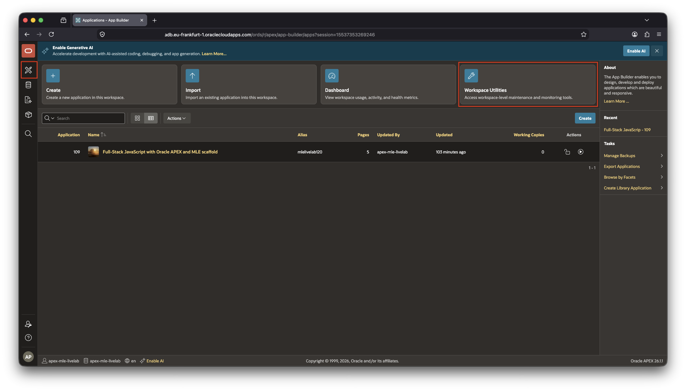
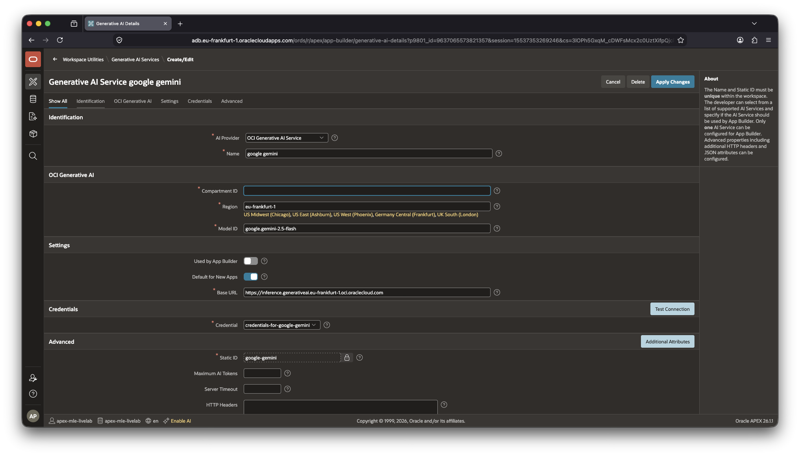
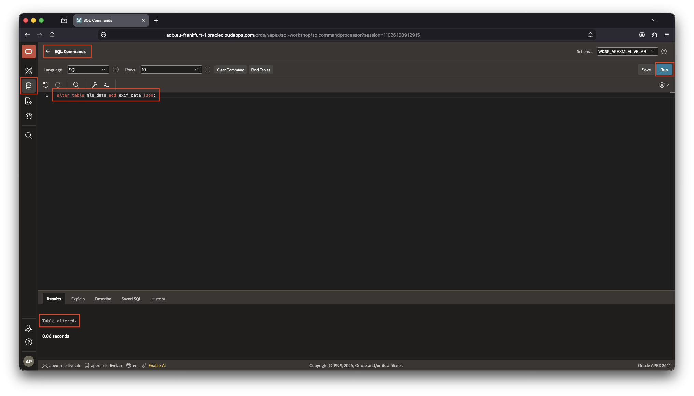
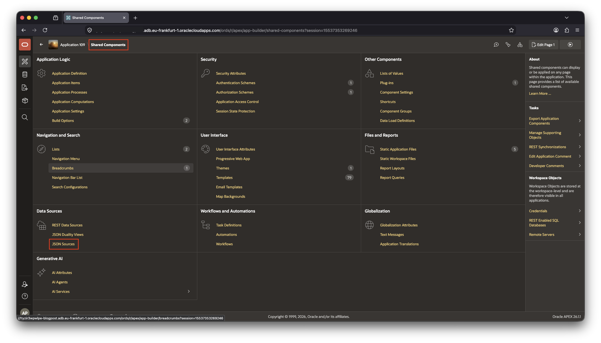

# Configure AI Services and a JSON Source

## Introduction

In this lab, you will configure an **AI service** used by the application, and create a **JSON Source** for the EXIF metadata stored in the database. EXIF (Exchangeable Image File Format) metadata is information embedded in an image file, such as the camera model, date, lens, exposure settings, and GPS coordinates. This information provides useful context when reviewing an image.

The application uses an AI service through its Static ID, `google-gemini`. You can of course define your own AI service if you prefer, just make sure it "understands" photos and assign it's own static ID and use it throughout the entire lab. Later modules call this service from JavaScript running in the database.

The JSON Source exposes the metadata stored in the `EXIF_DATA` JSON column of the `MLE_DATA` table so it can be used by APEX components. It gives APEX a structured view of the JSON document and its attributes, making the metadata easier to use in reports and other components. You will create this column as part of this lab.

This lab requires Oracle AI Database 26ai and Oracle APEX 26.1.

Estimated time to complete: 10 minutes

### Objectives

In this lab, you will:

- Create an OCI Generative AI service in APEX (or your alternative)
- Configure the service for the Google Gemini model
- Add a JSON column to the application's main table, `MLE_DATA`
- Create a local JSON Source for the EXIF metadata

### Prerequisites

This lab assumes that you completed [Lab 1](../lab-1/lab-1.md) and imported the application scaffold, including its supporting objects.

You also need access to an OCI Generative AI service and permission to use the selected compartment and model. The service sends the image to the selected model for analysis. The OCI credentials are stored in the APEX workspace configuration and are not part of the application export. If you prefer not to use an OCI GenAI service you are free to configure your own, this lab shows you how to configure OpenAI GPT-4o as an alternative. The advantage of the model being its low cost; GPT-4o may even be free of charge for you.

Regardless which route you decide to take, make sure you understand the potential cost implications of using the AI model of choice.

## Task 1: Create the APEX AI service

1. Open **App Builder**_** by clicking on the stylized APEX icon underneath the Oracle logo in the top-left corner
1. From the App Builder home page, open **Workspace Utilities**.



1. Select **Generative AI**.

   You now have a choice to create either an OCI GenAI service as detailed in the next section, or GPT-4o as an example of a potentially free model as explained in step 5.

1. Create an OCI GenAI Service

   Click **Create**_** to begin the definition of the AI Service.

   Configure the service as follows, values you see on the screen but not in the following steps are left at their defaults. These values tell APEX which OCI service, model, and compartment to use.

   - **AI Provider**: OCI Generative AI Service
   - **Name**: `google gemini` (use this exact name, including the white space).
   - **Compartment ID**: The OCID of the compartment that contains the Generative AI resources. A compartment is the OCI container in which the service is authorized to access the model.
   - **Region**: Select the OCI region by clicking on the name _below the textbox_ where the service is available, for example `Germany Central (Frankfurt)`. This click will populate the corresponding **Base URL**, like `eu-frankfurt-1`.
   - **Model ID**: `google.gemini-2.5-flash`. This identifies the Gemini model that will process the image.

   In the **Credentials** section, select an existing OCI credential configured for your workspace, or create one if your environment does not provide it. APEX uses this credential to authenticate the request without exposing secret values to the application. If you need to create the OCI API key, open the OCI Console, open your user profile in the top right corner, select **User Settings**, and open the **Tokens and Keys** tab. Click **Add API Key**, download the private key, and record the user OCID, tenancy OCID, fingerprint, and private key; these values are used to create the APEX Web Credential.

   If these are your first Web Credentials, populate the values in the form. If not, create the Web Credential from **Workspace Utilities** > **Web Credentials**, then select it in the Generative AI service configuration. Keep the private key in the credential store and never publish it.

   - **Static ID**: `google-gemini` will be automatically filled.  The Static ID is different from the display name: it is the stable, code-friendly identifier used by the application and by the MLE module. It must remain exactly as set, `google-gemini`.

   

   Click **Test Connection** to verify the configuration, then click **Create** or **Apply Changes**. See [below](#troubleshooting) for troubleshooting steps should you encounter errors.

1. Create an OpenAI ChatGPT-4o Service

   The process is nearly identical to the one above. Click **Create** to begin the definition of the AI Service.

   Configure the service as follows, values you see on the screen but not in the following steps are left at their defaults.

   - **AI Provider**: OpenAI
   - **Name**: whichever name you prefer
   - **API Key**: your OpenAI API key
   - **AI Model**: `gpt-4o`

   You can use the **Test Connection** button to ensure your configuration works.

The AI service is now available to the application through APEX AI Services. The remainder of this Livelab assumes the use of Gemini. If you chose a different model, you need to adapt the later labs to your AI Service.

## Task 2: Add a JSON column to MLE_DATA

The EXIF information this app will extract from a photo is provided in JSON format. The best way to persist the meta information along with the photo is to store it in a JSON column. `MLE_DATA` currently doesn't feature a JSON column, let's add it in the next step.

1. Open **SQL Workshop** and select **SQL Commands**.
1. Run the following statement:

   ```sql
   <copy>
   alter table
      mle_data
   add
      exif_data json;
   </copy>
   ```

   

The DDL statement adds the `EXIF_DATA` JSON column without deleting or changing any existing image records. The JSON data type allows each image record to store a flexible set of metadata attributes, such as camera model, exposure settings, and GPS coordinates, without adding a separate relational column for every possible EXIF field. Confirm that the statement completes successfully before continuing.

## Task 3: Create the JSON Source

In this task, you will connect an APEX JSON Source to the `EXIF_DATA` column in `MLE_DATA`. The source does not parse the image itself. Instead, it tells APEX where the JSON metadata is stored and which column should be used when APEX components need to read that metadata.

1. Return to **App Builder** and open the application you imported in Lab 1.

   The application must be open before you select a JSON Source because JSON Sources are application-level shared components.

2. Open **Shared Components**.
3. Under **Data Sources**, select **JSON Sources**.

   

   The JSON Sources page lists the JSON sources already defined for this application. In the current scaffold, no source is defined yet, so the page displays an empty list.

4. Click **Create**.

The **Create JSON Source** dialog is the first screen of the creation wizard. A JSON Source is an APEX data source that reads JSON documents from a database table or another supported location. It tells APEX where the JSON is stored and allows APEX to use the attributes inside the document without copying the data into separate columns.

Configure this screen as follows:

- **Name**: Enter `EXIF_SOURCE`. This is the descriptive name shown in APEX when you select the source later.
- **JSON Source Type**: Select **Table with JSON Columns**. This option is used because the JSON document is stored in a column of a local database table.
- **Location**: Keep **Local Database** selected. The metadata is stored in the local Oracle Database, not in a remote REST service.
- **Owner**: Select the schema that owns the `MLE_DATA` table. In the workshop environment this is `ORACLE`; in another environment, select the schema used by your APEX workspace.
- **Table with JSON Columns**: Select `MLE_DATA`. This table contains one image record per uploaded image and provides the columns shown on the next screen.

When these values are entered, click **Next**.

On the **JSON Columns** screen, APEX lists the columns from `MLE_DATA` that can contain JSON documents. APEX needs this information to identify the metadata document and inspect its attributes. The first field is required. If **JSON Column 1** is left at **- Select -** and you click **Next**, APEX displays the error **JSON Column 1 must have some value**.

- For **JSON Column 1**, select `EXIF_DATA`. This column is populated later by the MLE JavaScript module after it extracts the EXIF metadata from the uploaded image.
- Leave **JSON Schema for Column 1** and **JSON Column 2** with their respective default. The application uses only one JSON column.

Click **Next** to continue.

The table `MLE_DATA` stores one image record per uploaded image. Its `EXIF_DATA` column stores the metadata as a JSON document because EXIF fields can vary between cameras and images. The JSON Source reads that document for APEX components; it does not create a second copy of the metadata.

The **Data Profile** screen is the final step of the wizard. A data profile is a description of the structure of a JSON document. It lists the attributes that APEX discovered, the data type assigned to each attribute, and the JSON path from which the value is read. For example, an attribute such as `Model` is mapped to the `Model` value inside the `EXIF_DATA` document.

Review the detected attributes and accept the defaults for this lab. The profile should show `EXIF_DATA` as the source for the EXIF attributes. No manual changes or schema file are required.

APEX generates the Static ID automatically. Click **Create** to save the JSON Source and its data profile.

APEX creates the JSON Source and its data profile for the EXIF document. The data profile describes the attributes found in the JSON, such as camera information, timestamps, and location data. APEX can now use these attributes in reports and other application components.

## Verify the configuration

Confirm that the following objects are available:

- A Generative AI service with Static ID `google-gemini`
- A JSON Source named `EXIF_SOURCE` with Static ID `exif_source`
- `MLE_DATA.EXIF_DATA` configured as the JSON column

You are now ready to continue with [Lab 3: Import third-party JavaScript modules into the database](../lab-3/lab-3.md).

## Troubleshooting

Based on your configuration you may have to enable outbound network traffic. Autonomous AI Database shouldn't require this step, others such as self-hosted instances do. Should you get errors similar in wording to "request denied due to Network ACL", this snippet should solve problem. It must be executed by an administrator.

```sql
<copy>
begin
    dbms_network_acl_admin.append_host_ace(
        host => '*.oci.oraclecloud.com',
        ace  =>  xs$ace_type(
            privilege_list => xs$name_list('http'),
            principal_name => 'APEX_260100',
            principal_type => xs_acl.ptype_db
        )
    );
    commit;
end;
/
</copy>
```

Refer to the [APEX documentation for more details](https://docs.oracle.com/en/database/oracle/apex/26.1/htmig/enabling-network-services.html).

## Learn More

- [APEX App Builder User's Guide: Generative AI](https://docs.oracle.com/en/database/oracle/apex/26.1/htmdb/using-generative-ai.html)
- [APEX App Builder User's Guide: JSON Sources](https://docs.oracle.com/en/database/oracle/apex/26.1/htmdb/managing-json-data.html)
- [Oracle Cloud Infrastructure Generative AI](https://docs.oracle.com/en-us/iaas/Content/generative-ai/home.htm)

## Acknowledgements

- **Author** - Sonja Meyer, Consulting Member of Technical Staff
- **Contributors** - Martin Bach, Senior Principal Product Manager
- **Last Updated By/Date** - Sonja Meyer, Consulting Member of Technical Staff, July 2026
