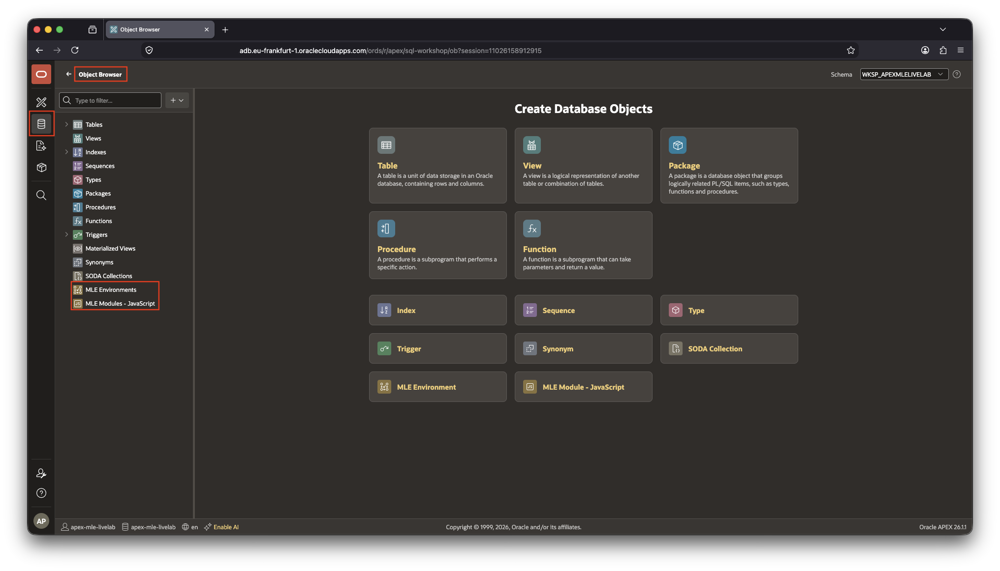
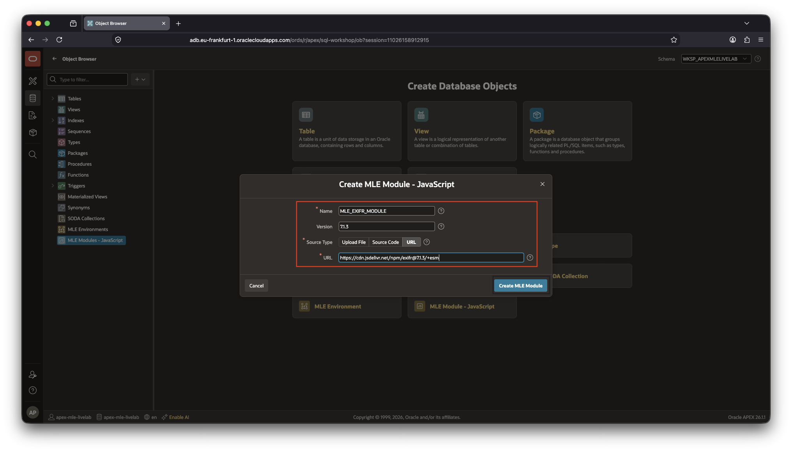
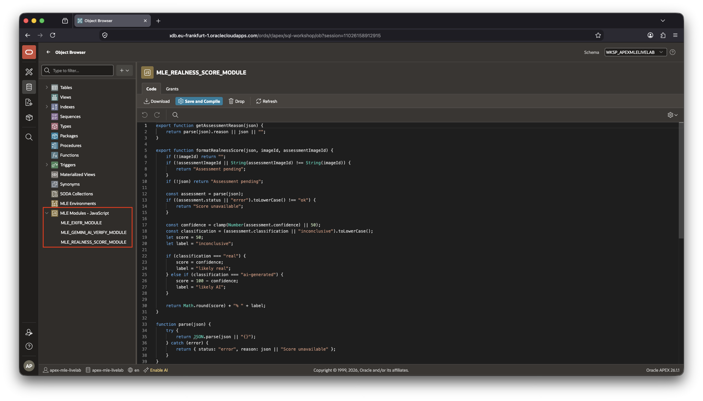
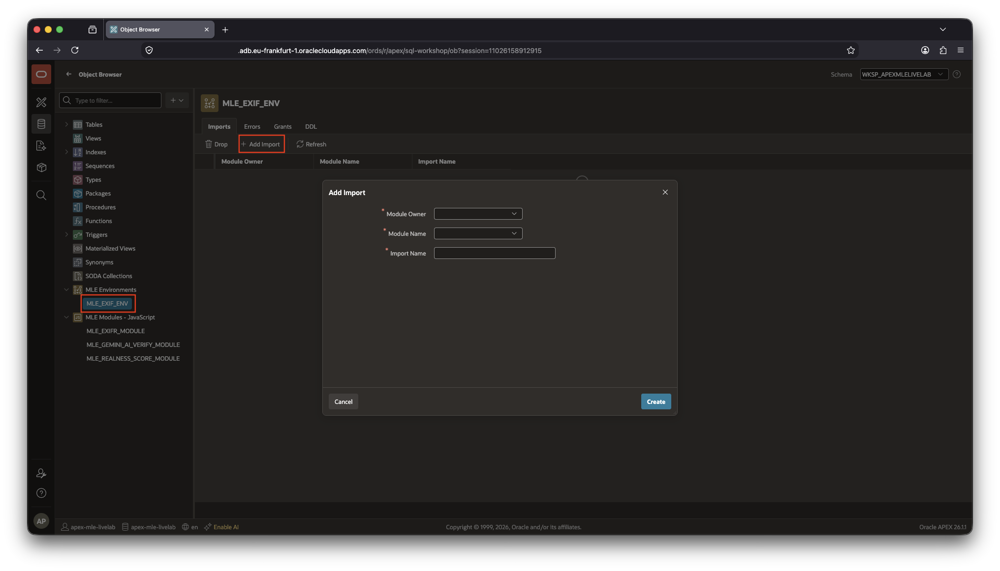

# Import JavaScript modules into the database

## Introduction

In this lab, you will import JavaScript modules into Oracle AI Database 26ai and make them available through an MLE environment. Multilingual Engine (MLE) allows JavaScript to run close to the data inside the database. The modules can query database tables, process files, and call database functionality while the application uses familiar JavaScript imports. You can think of JavaScript modules as PL/SQL packages, dedicated namespaces for grouping related functionality together. Just as with PL/SQL, JavaScript can have public and private variables, functions, etc. in a module.

You will create three modules for the image analysis application:

- `MLE_EXIFR_MODULE` loads the third-party `exifr` library. It extracts EXIF metadata from an uploaded image.
- `MLE_EXIF_HELPER_MODULE` uses the previously created `MLE_EXIFR_MODULE` to extract and verify EXIF data from a photo and saves it into the database.
- `MLE_GEMINI_AI_VERIFY_MODULE` reads an image from `MLE_DATA` and calls the configured APEX AI service.
- `MLE_REALNESS_SCORE_MODULE` converts the structured AI response into text for the APEX user interface.

The modules are kept separate so that each one has a clear responsibility. The MLE environment then gives them the import names that the APEX application uses.

This lab requires Oracle AI Database 26ai and Oracle APEX 26.1.

Estimated time to complete: 15 minutes

### Objectives

In this lab, you will:

- Allow the browser to provide location information for the map
- Create the three JavaScript MLE modules
- Create the `MLE_EXIF_ENV` environment
- Add the modules to the environment with the required import names

### Prerequisites

This lab assumes that you completed [Lab 2](../lab-2/lab-2.md) and created the `google gemini` Generative AI service and the `EXIF_SOURCE` JSON Source.

## Task 1: Allow Location Access

The application includes a map that can use the browser's location service. When the browser displays a message such as **Allow _your host_:7005 to access your location?**, click **Allow**. You can select **Remember this decision** if you want the browser to remember the permission.

This permission belongs to the browser and is separate from the MLE environment. It allows the map to use the current location; it does not grant the application access to your OCI credentials or database account. If you select **Block** by mistake, open the browser's site permissions for the APEX URL and enable **Location** before continuing.

## Task 2: Open the MLE module area

MLE modules are database objects. They are not APEX page components, so create them in the database schema that owns `MLE_DATA` and the MLE environment. In the workshop environment, this is the schema you selected or created when you provisioned the workspace. Use **Object Browser** to create database objects in APEX.



## Task 3: Create the EXIF module and Helper Code

1. Open **Object Browser**.
1. In the tree structure on the left-hand side, right-click on **MLE Modules - JavaScript**
1. Select **Create MLE Module - JavaScript** from the context menu

Create a JavaScript module with the following values:

- **Module Name**: `MLE_EXIFR_MODULE`
- **Version**: 7.1.3
- **Source Type**: URL
- **URL**: `https://cdn.jsdelivr.net/npm/exifr@7.1.3/+esm`

Create the JavaScript module in the database by clicking on **Create MLE Module**.



The EXIFR module is responsible for reading metadata from the image BLOB you upload via the APEX application. It does not call Gemini and does not calculate a score. Keeping this work in a separate module makes the EXIF extraction reusable and easier to understand. EXIFR is a third-party dependency in a production-like format typical for JavaScript.

In the next step you create another JavaScript module performing the task of reading the EXIF information from a photo, validating it, extracting only the EXIF data of interest, and persisting it in the database. You will use this module in [lab 4](../lab-4/lab-4.md)

Create another MLE JavaScript module

- **Module Name**: `MLE_EXIF_HELPER_MODULE`
- **Version**: 1.0
- **Source Type**: Source Code

Paste the following source code into the window and hit Save and Compile.

```javascript
<copy>
/*
 * this module relies on the functionality provided by the exifr module
 * to extract EXIF data from photos. It must first be imported before
 * it can be used.
 */
import exifr from 'exifr-module';

/*
 * List of EXIF properties that the application intends to persist.
 *
 * exifr may return many more properties depending on:
 *   - the image format,
 *   - the camera or device,
 *   - the available EXIF, IPTC, XMP, or GPS metadata,
 *   - and the parser configuration.
 *
 * Restricting the stored object to known fields keeps the JSON predictable,
 * prevents unnecessary metadata from being stored, and reduces the chance of
 * persisting sensitive or application-irrelevant information.
 *
 * Object.freeze() prevents accidental modification of this array at runtime.
 */
const EXIF_FIELDS = Object.freeze([
    'ColorSpace',
    'GPSDateStamp',
    'ISO',
    'OffsetTimeDigitized',
    'LensModel',
    'latitude',
    'longitude',
    'LensMake',
    'ExposureProgram',
    'GPSAltitude',
    'SceneType',
    'ModifyDate',
    'CreateDate',
    'ExifVersion',
    'ExposureMode',
    'Software',
    'Orientation',
    'ExifImageHeight',
    'ExifImageWidth',
    'Make',
    'HostComputer',
    'Model',
    'DateTimeOriginal'
]);


/**
 * Copies selected properties from a source object into a new object.
 *
 * Only properties whose value is not undefined are included.
 *
 * This is important because:
 *   - EXIF fields are optional;
 *   - different cameras provide different metadata;
 *   - JSON does not preserve properties whose value is undefined;
 *   - valid falsy values, such as 0, must not be discarded.
 *
 * Values such as null, false, an empty string, and 0 are retained.
 *
 * @param {object} source
 *     Object containing the parsed EXIF metadata.
 *
 * @param {string[]} propertyNames
 *     Names of the properties that may be copied.
 *
 * @returns {object}
 *     A new object containing only the requested properties that exist.
 */
function selectProperties(source, propertyNames) {
    const result = {};

    for (const propertyName of propertyNames) {
        const value = source[propertyName];

        // Do not use a truthiness check here.
        //
        // For example, the numeric value 0 may be valid and should not be
        // omitted merely because Boolean(0) is false.
        if (value !== undefined) {
            result[propertyName] = value;
        }
    }

    return result;
}


/**
 * Validates and normalizes a latitude value.
 *
 * Valid latitude values are finite numbers in the inclusive range:
 *   -90 through 90
 *
 * Invalid, missing, NaN, or infinite values are normalized to null so they
 * can safely be stored as SQL NULL in the database.
 *
 * @param {*} value
 *     Candidate latitude returned by exifr.
 *
 * @returns {number|null}
 *     The valid latitude, or null when the value is invalid.
 */
function normalizeLatitude(value) {
    return Number.isFinite(value) && value >= -90 && value <= 90
        ? value
        : null;
}


/**
 * Validates and normalizes a longitude value.
 *
 * Valid longitude values are finite numbers in the inclusive range:
 *   -180 through 180
 *
 * Invalid, missing, NaN, or infinite values are normalized to null so they
 * can safely be stored as SQL NULL in the database.
 *
 * @param {*} value
 *     Candidate longitude returned by exifr.
 *
 * @returns {number|null}
 *     The valid longitude, or null when the value is invalid.
 */
function normalizeLongitude(value) {
    return Number.isFinite(value) && value >= -180 && value <= 180
        ? value
        : null;
}

/**
 * Extract and save EXIF data. Validates it and throws errors if validation
 * fails
 * 
 * @param imageId the photo's ID
 */
export async function extractAndSaveEXIF(imageId) {
    try {
        // Retrieve the image BLOB from the database.
        //
        // fetchInfo instructs the Oracle database driver to return FILE_BLOB as a
        // Uint8Array. This representation can be passed directly to exifr.
        //
        // Returning a Uint8Array is especially useful in Oracle MLE because MLE
        // does not rely on the Node.js Buffer class for binary data.
        const queryResult = apex.conn.execute(
            `
            select file_blob
            from mle_data
            where id = :id
            `,
            {
                // Explicitly bind the image ID as an Oracle NUMBER.
                //
                // Explicit bind types make the database interaction easier to
                // understand and avoid relying on implicit type inference.
                id: {
                    type: oracledb.NUMBER,
                    val: imageId
                }
            },
            {
                fetchInfo: {
                    FILE_BLOB: {
                        type: oracledb.UINT8ARRAY
                    }
                }
            }
        );


        // The query is expected to return exactly one row because imageId should
        // uniquely identify an image record.
        const rowCount = queryResult.rows.length;


        // A missing image is treated as an error because the requested record
        // cannot be processed.
        if (rowCount === 0) {
            throw new Error(`No image found with ID ${imageId}`);
        }


        // More than one row indicates that the database does not enforce the
        // expected uniqueness rule, or that the query assumptions are incorrect.
        //
        // Ideally, the ID column should have a primary-key or unique constraint,
        // making this condition impossible.
        if (rowCount > 1) {
            throw new Error(
                `Expected one image with ID ${imageId}, but found ${rowCount}`
            );
        }


        // Extract the binary image data from the single returned row.
        const imageBytes = queryResult.rows[0].FILE_BLOB;


        // Verify that the database driver returned the expected binary type.
        //
        // This protects the EXIF parser from receiving an unexpected value such
        // as null, a string, a LOB locator, or another object type.
        if (!(imageBytes instanceof Uint8Array)) {
            throw new TypeError(
                `Expected image ${imageId} to be returned as a Uint8Array`
            );
        }


        // An empty byte array cannot represent a readable image.
        if (imageBytes.byteLength === 0) {
            throw new Error(`Image ${imageId} contains no data`);
        }


        // Parse the image metadata.
        //
        // Pass the Uint8Array directly to exifr.
        //
        // Do not automatically pass imageBytes.buffer. A Uint8Array may represent
        // only a subsection of its underlying ArrayBuffer. In that case, passing
        // the backing buffer could expose bytes before or after the intended
        // typed-array view.
        //
        // exifr.parse() may throw when:
        //   - the file format is unsupported,
        //   - the image is malformed,
        //   - the metadata structure is corrupt,
        //   - or another parser-level error occurs.
        //
        // Any such error is caught by the outer catch block and rethrown with
        // additional image context.
        const parsedExif = await exifr.parse(imageBytes);


        // A valid image may contain no EXIF metadata.
        //
        // This is not necessarily an application error. Screenshots, processed
        // images, privacy-sanitized images, and some generated files commonly have
        // no EXIF data.
        //
        // In this version, the existing database values are left unchanged when
        // no metadata is found.
        if (!parsedExif) {
            return;
        }


        // Create a sanitized metadata object containing only the fields the
        // application has explicitly chosen to retain.
        //
        // This object, rather than the complete exifr result, will be stored in the
        // JSON column.
        const exifData = selectProperties(parsedExif, EXIF_FIELDS);


        // Validate the derived GPS coordinates before storing them in dedicated
        // NUMBER columns.
        //
        // Invalid or absent values become null, which the Oracle driver binds as
        // SQL NULL.
        const latitude = normalizeLatitude(parsedExif.latitude);
        const longitude = normalizeLongitude(parsedExif.longitude);


        // Persist the sanitized EXIF metadata and normalized coordinates.
        //
        // The JSON object and relational GPS columns are updated together so that
        // they remain consistent within the same SQL statement.
        const updateResult = apex.conn.execute(
            `
            update mle_data
            set exif_data = :data,
                lon       = :lon,
                lat       = :lat
            where id = :id
            `,
            {
                // Bind the selected EXIF properties as Oracle's native JSON type.
                //
                // JavaScript Date objects returned by exifr may be represented as
                // Oracle JSON timestamp values, depending on the MLE database
                // driver behavior and database version.
                data: {
                    type: oracledb.DB_TYPE_JSON,
                    val: exifData
                },

                // Bind null when no valid longitude is available.
                lon: {
                    type: oracledb.NUMBER,
                    val: longitude
                },

                // Bind null when no valid latitude is available.
                lat: {
                    type: oracledb.NUMBER,
                    val: latitude
                },

                // Restrict the update to the image that was originally fetched.
                id: {
                    type: oracledb.NUMBER,
                    val: imageId
                }
            }
        );


        // The earlier SELECT found exactly one record, so the UPDATE should affect
        // exactly one record as well.
        //
        // A different count could indicate:
        //   - the record was deleted between the SELECT and UPDATE,
        //   - the transaction isolation assumptions are incorrect,
        //   - a trigger or database rule altered the operation,
        //   - or the table no longer enforces unique IDs.
        if (updateResult.rowsAffected !== 1) {
            throw new Error(
                `Expected to update one image with ID ${imageId}, but updated ` +
                `${updateResult.rowsAffected}`
            );
        }
    } catch (error) {
        // Convert non-Error thrown values into readable text.
        //
        // JavaScript permits throwing any value, although throwing Error objects
        // is the recommended convention.
        const message =
            error instanceof Error
                ? error.message
                : String(error);


        // Add the image ID to the error message while preserving the original
        // exception as the cause.
        //
        // Keeping the original cause is useful because callers may inspect:
        //   - the original error type,
        //   - the original stack trace,
        //   - database-driver-specific properties,
        //   - or parser-specific details.
        //
        // No commit or rollback is performed here. Transaction ownership remains
        // with the surrounding APEX or MLE caller.
        throw new Error(
            `Failed to process EXIF data for image ${imageId}: ${message}`,
            { cause: error }
        );
    }
}
</copy>
```

## Task 4: Create the Gemini verification module

Create a second JavaScript module:

- **Module Name**: `MLE_GEMINI_AI_VERIFY_MODULE`
- **Version**: 1.0
- **Source Type**: Source Code

Paste the following source into the code editor and click **Create MLE Module**:

```javascript
<copy>
export function analyzePhotoWithGemini(id) {
    if (!id) throw new Error("Please provide an image record ID.");

    const photo = session.execute(
        `select 1 from MLE_DATA where id = :id and file_blob is not null`,
        { id }
    );

    if (photo.rows.length !== 1) {
        return {
            status: "no-image",
            classification: "inconclusive",
            confidence: null,
            reason: "No image available for analysis."
        };
    }

    try {
        const result = session.execute(
            `
            declare
                l_blob blob;
                l_mime varchar2(255);
                l_name varchar2(255);
                l_response clob;
                l_attachments apex_ai.t_attachments := apex_ai.t_attachments();
            begin
                select file_blob, nvl(file_mime, 'image/jpeg'),
                       nvl(file_name, 'photo.jpg')
                  into l_blob, l_mime, l_name
                  from MLE_DATA
                 where id = :id;

                l_attachments.extend;
                l_attachments(1).mime_type := l_mime;
                l_attachments(1).content_blob := l_blob;
                l_attachments(1).file_name := l_name;
                l_attachments(1).detail_level := apex_ai.c_detail_level_high;

                l_response := apex_ai.generate(
                    p_service_static_id => 'google-gemini',
                    p_system_prompt => q'~
                        Assess whether the supplied photo is camera-captured or AI-generated.

                        Return only a JSON object that conforms to the supplied response schema.
                        Do not include Markdown, code fences, commentary, or additional properties.
                    ~',

                    p_prompt => q'~
                        Analyze the photo and return:
                        - status
                        - classification
                        - confidence from 0 to 100
                        - one short reason
                    ~',
                    p_temperature => 0.2,
                    p_attachments => l_attachments,
                    p_response_json_schema => q'~
                        {
                        "type": "object",
                        "additionalProperties": false,
                        "properties": {
                            "status": {
                            "type": "string",
                            "enum": [
                                "success"
                            ]
                            },
                            "classification": {
                            "type": "string",
                            "enum": [
                                "camera-captured",
                                "ai-generated",
                                "uncertain"
                            ]
                            },
                            "confidence": {
                            "type": "integer",
                            "minimum": 0,
                            "maximum": 100
                            },
                            "reason": {
                            "type": "string",
                            "minLength": 1,
                            "maxLength": 300
                            }
                        },
                        "required": [
                            "status",
                            "classification",
                            "confidence",
                            "reason"
                        ]
                        }
                    ~'
                );

                insert into test(result_clob) values ( l_response);
                commit;

                :assessment := JSON(l_response);
            end;`,
            {
                id,
                assessment: {
                    dir: oracledb.BIND_OUT,
                    type: oracledb.DB_TYPE_JSON,
                }
            }
        );
        return result.outBinds.assessment;
    } catch (err) {
        return {
            status: "error",
            classification: "inconclusive",
            confidence: null,
            reason: `AI assessment unavailable: ${err}`
        };
    }
}
</copy>
```

This module first checks whether the requested `MLE_DATA` record contains an image. It then uses `session.execute` to load the BLOB representing the image and calls `APEX_AI.GENERATE` with the native APEX attachment type. JavaScript controls the overall flow, while PL/SQL is used only inside the module where APEX AI requires native database types. MLE/JavaScript understands PL/SQL Records and Collections, alternatively this embedded PL/SQL block could have been written entirely in JavaScript. For the sake of this Livelab though the PL/SQL approach was chosen to demonstrate how easy it is to create interoperability between SQL, PL/SQL and JavaScript.

The module calls the AI service you created in lab 2 using the Static ID `google-gemini`. This is why the service created in Lab 2 must use the exact Static ID; update the static ID if you created your own AI service that deviates from the lab. Note how the module returns structured JSON containing a status, classification, confidence, and reason so the APEX page can handle successful and failed AI calls consistently.

## Task 5: Create the realness score module

Create a third JavaScript module:

- **Module Name**: `MLE_REALNESS_SCORE_MODULE`
- **Version**: 1.0
- **Source Type**: Source Code

Paste the following source into the code editor and click **Create MLE Module**:

```javascript
<copy>
export function getAssessmentReason(json) {
    return json.reason || json || "";
}

export function formatRealnessScore(assessment, imageId, assessmentImageId) {
    if (!imageId) {
        throw new Error('you must provide an image ID to formatRealnessScore()');
    }

    if (!assessmentImageId || String(assessmentImageId) !== String(imageId)) {
        return "Assessment pending";
    }
    
    if (!assessment) return "Assessment pending";

    if ((assessment.status || "error").toLowerCase() !== "success") {
        return "Score unavailable";
    }

    const confidence = assessment.confidence || 50;
    const classification = (assessment.classification || "inconclusive").toLowerCase();
    let score = 50;
    let label = "inconclusive";

    if (classification === "camera-captured") {
        score = confidence;
        label = "likely real";
    } else if (classification === "ai-generated") {
        score = 100 - confidence;
        label = "likely AI";
    }

    return Math.round(score) + "% " + label;
}
</copy>
```

This module contains only presentation helpers. It parses the JSON returned by the Gemini module, extracts the short reason shown in the application, and formats the score. It does not call an AI service and does not access the image table. Keeping this logic separate prevents the APEX page from having to calculate scores itself.



## Task 6: Create the MLE environment

Later in this lab you will make references to the three MLE modules you just created in Page Designer. In order to do so, you need to import the module by an import name of your choice. For Oracle AI Database to map the import name to a schema object, MLE environments are used.

1. In **Object Browser**, right-click **MLE Environments**.
1. Click **Create MLE Environment** in the context menu.
1. Enter `MLE_EXIF_ENV` as the environment name.
1. Click **Create MLE Environment** to create it.
1. Click on the environment's name to open the imports tab. You may have to expand the _MLE Environments_ node in the tree view.
1. Click **Add Import** for each of the three modules.



An MLE environment maps the module names used by JavaScript `import` statements to database MLE modules. The import name is therefore part of the application contract and must be entered exactly as shown below:

| Module Owner | Module Name | Import Name |
| --- | --- | --- |
| Your workspace's parsing schema | `MLE_EXIFR_MODULE` | `exifr-module` |
| Your workspace's parsing schema | `MLE_EXIF_HELPER_MODULE` | `exifr-helper` |
| Your workspace's parsing schema | `MLE_GEMINI_AI_VERIFY_MODULE` | `gemini-ai-verify-module` |
| Your workspace's parsing schema | `MLE_REALNESS_SCORE_MODULE` | `realness-score-module` |

Do not change the capitalization of the module names or the spelling of the import names. The APEX page uses these import names when it loads the modules. The module owner must match the schema in which you created the modules.

Confirm that all three imports are listed without errors. The environment is resolved when the APEX page runs the MLE code; there is no separate JavaScript compilation step for the import mappings.

## Task 7: Assign the MLE environment to the application

The MLE environment must also be assigned to the APEX application. Creating the environment in the database alone is not enough; the application needs to know which environment resolves imports such as `exifr-module` and `gemini-ai-verify-module`.

1. Return to **App Builder** and click on the application name.
1. Click on **Shared Components** then **Security Attributes**
1. Select the **Security** tab.
1. In the **Database Session** section, keep the correct **Parsing Schema** selected.
1. For **MLE Environment**, select `MLE_EXIF_ENV`.
1. Save the application settings.

The application is now associated with `MLE_EXIF_ENV`. When an APEX page executes MLE JavaScript, its `import` statements are resolved against this environment and its three module mappings.

## Verify the configuration

Confirm that the following objects are available in the database using the **Object Browser**:

- `MLE_EXIFR_MODULE`
- `MLE_EXIF_HELPER_MODULE`
- `MLE_GEMINI_AI_VERIFY_MODULE`
- `MLE_REALNESS_SCORE_MODULE`
- `MLE_EXIF_ENV`

Confirm that `MLE_EXIF_ENV` contains these exact import mappings:

- `exifr-module` → `MLE_EXIFR_MODULE`
- `gemini-ai-verify-module` → `MLE_GEMINI_AI_VERIFY_MODULE`
- `realness-score-module` → `MLE_REALNESS_SCORE_MODULE`

The environment is now ready for the APEX application. In the next lab, you will use the modules to extract EXIF metadata, call Gemini, and display the image assessment.

## Learn More

- [Oracle Database JavaScript Developer's Guide: Multilingual Engine](https://docs.oracle.com/en/database/oracle/oracle-database/26/mlejs/index.html)
- [Oracle Database JavaScript Developer's Guide: JavaScript Modules](https://docs.oracle.com/en/database/oracle/oracle-database/26/mlejs/using-javascript-modules.html)
- [Oracle Database JavaScript Developer's Guide: MLE Environments](https://docs.oracle.com/en/database/oracle/oracle-database/26/mlejs/using-mle-environments.html)

## Acknowledgements

- **Author** - Sonja Meyer, Consulting Member of Technical Staff
- **Contributors** - Martin Bach, Senior Principal Product Manager
- **Last Updated By/Date** - Martin Bach, Senior Principal Product Manager, July 2026
