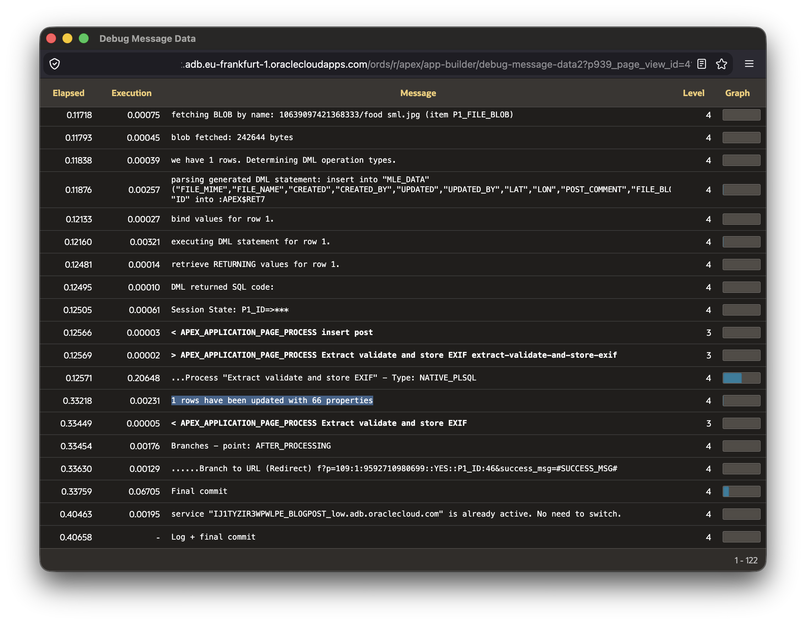

# Optionally implement enhanced Features

## Introduction

In all previous labs you implemented the application up to a state where it worked. You could upload photos, and the APEX process invoking MLE/JavaScript extracted EXIF data from the photo (if present), stored it in a table, and presented it. In this lab you add extra features like debugging. You'll also remove the PL/SQL code from MLE_GEMINI_AI_VERIFY_MODULE and replace it with the JavaScript    

This lab requires Oracle AI Database 26ai, Oracle APEX 26.1, and the `MLE_EXIF_ENV` environment plus all the MLE modules created in the previous lab.

Estimated time to complete: 10 minutes

### Prerequisites

Complete [Lab 3](../lab-3/lab-3.md) first. The application uses the `MLE_DATA` table, including its `EXIF_DATA` JSON column.

The `EXIF_DATA` column is populated by the EXIF MLE module after an image is uploaded. Keep the table name `MLE_DATA` throughout this lab.

### Objectives

In this lab, you will:

- Finish all APEX pages
- Add logic to extract EXIF data to page 1
- Complete the image detail page by passing it to Gemini for an assessment and displaying the location where the photo was taken

## Task 1: Improve UX by adding CSS to Page 2

The scaffold you started your journey with came with custom CSS classes. You can see them in page designer. Open Page 2, then left click on "Page 2: Photo Metadata Details".

Scroll down to the CSS section, then you'll see the CSS classes listed inline. To enable them, you need to set HTML DOM IDs; you find them in the region's _advanced_ section. These are selectors to which the CSS classes attach. You need to edit these for all regions on the page:

| Region | HTML DOM ID |
| -- | -- |
| Realness Score | `realness-score` |
| Summary | `exif-details` |
| Photo | `exif-photo` |
| Map | `exif-map` |
| Google Gemini AI Analysis | `google-ai-analysis` |
| EXIF Data | `exif-data` |

Save and reload the page, you should see a distinctly different appearance.

## Task 2: Help users debug issues with the EXIF extraction process

The EXIF extraction code you added to page 1 does the job well, but it won't help much in case something goes wrong. The code is shown here for your convenience:

```javascript
// Load the EXIF library from the MLE environment.
const { default: exifr } = await import('exifr-module');

// get the post ID from the APEX page
const postId = apex.env.P1_ID;

// Fetch the uploaded image as a byte stream, so exifr can read it.
const photo = apex.conn.execute(
    `
    select file_blob
    from mle_data
    where id = :id
    `,
    {
        id: { val: postId }
    },
    {
        fetchInfo: {
            FILE_BLOB: {
                type: oracledb.UINT8ARRAY
            }
        }
    });

if (photo.rows.length !== 1) {
    throw new Error('no photo found on this page');
}

// Parse EXIF metadata with the JavaScript library.
const exifData = await exifr.parse(photo.rows[0].FILE_BLOB.buffer);

if (!exifData) {
    return;
}

// Store the EXIF JSON and GPS coordinates back in the database.
const updateResult = apex.conn.execute(
    `
    update mle_data
    set exif_data = :data,
        lon = :lon,
        lat = :lat
    where id = :id
    `,
    {
        data: {
            type: oracledb.DB_TYPE_JSON,
            val: exifData
        },
        lon: {
            type: oracledb.NUMBER,
            val: exifData.longitude === undefined ? null : exifData.longitude
        },
        lat: {
            type: oracledb.NUMBER,
            val: exifData.latitude === undefined ? null : exifData.latitude
        },
        id: { val: postId }
    }
);
```

If you look closely, you get errors when things go awry, but you may want to have more information available. Thankfully APEX has a facility for this, it's called `APEX_DEBUG` (🔗 [docs](https://docs.oracle.com/en/database/oracle/apex/26.1/aeapi/APEX_DEBUG.html)). It's a very useful package as it allows you to print debug messages into the standard APEX developer UI.

There is a catch though: if you wanted to call `APEX_DEBUG` in JavaScript, you'd have to use anonymous PL/SQL blocks to do that:

```javascript
// ...
apex.conn.execute(`begin apex_debug.info('Important: %s', 'some string'); end;');
// ...
```

This isn't particularly close to a native JavaScript experience. The PL/SQL Foreign Function Interface (plsffi) addresses this problem by allowing you to resolve packages, functions, and procedures to JavaScript variables. You can read more about the feature in the JavaScript Developer's Guide, linked in the reference section.

The above example can be rewritten using the PL/SQL Foreign Function Interface as follows:

```javascript
// variable d resolves to APEX_DEBUG. It's an object with members representing
// each function in the package.
const d = plsffi.resolvePackage('APEX_DEBUG');

// ...

d.info('Important: %s', 'some string');

// ...
```

This allows you to add a lot more detail to the process, as shown here:

```javascript
<copy>
// Load the EXIF library from the MLE environment.
const { default: exifr } = await import('exifr-module');

// get the post ID from the APEX page
const postId = apex.env.P1_ID;
const d = plsffi.resolvePackage('APEX_DEBUG');

// Fetch the uploaded image as a byte stream, so exifr can read it.
const photo = apex.conn.execute(
    `
    select file_blob
    from mle_data
    where id = :id
    `,
    {
        id: { val: postId }
    },
    {
        fetchInfo: {
            FILE_BLOB: {
                type: oracledb.UINT8ARRAY
            }
        }
    });

if (photo.rows.length !== 1) {
    d.info(`no photo found for id ${postId}`);
    throw new Error('no photo found on this page');
}

// Parse EXIF metadata with the JavaScript library.
const exifData = await exifr.parse(photo.rows[0].FILE_BLOB.buffer);

if (!exifData) {
    d.info(`no EXIF data found for photo id ${postId}`);
    return;
}

// Store the EXIF JSON and GPS coordinates back in the database.
const updateResult = apex.conn.execute(
    `
    update mle_data
    set exif_data = :data,
        lon = :lon,
        lat = :lat
    where id = :id
    `,
    {
        data: {
            type: oracledb.DB_TYPE_JSON,
            val: exifData
        },
        lon: {
            type: oracledb.NUMBER,
            val: exifData.longitude === undefined ? null : exifData.longitude
        },
        lat: {
            type: oracledb.NUMBER,
            val: exifData.latitude === undefined ? null : exifData.latitude
        },
        id: { val: postId }
    }
);
d.info(`${updateResult.rowsAffected} rows have been updated with ${Object.keys(exifData).length} properties`);
</copy>
```

If everything goes to plan, you shouldn't see much output. In the following example the final line is the only one printed in the debug output:



## Learn More

- [Oracle Database JavaScript Developer's Guide: Multilingual Engine](https://docs.oracle.com/en/database/oracle/oracle-database/26/mlejs/index.html)
- [Oracle Database JSON Developer's Guide: JSON_TABLE](https://docs.oracle.com/en/database/oracle/oracle-database/26/adjsn/json_table-sql-function.html)
- [APEX App Builder User's Guide: Page Designer](https://docs.oracle.com/en/database/oracle/apex/26.1/htmdb/page-designer.html)

## Acknowledgements

- **Author** - Martin Bach, Senior Principal Product Manager
- **Contributors** - Sonja Meyer, Consulting Member of Technical Staff
- **Last Updated By/Date** - Martin Bach, Senior Principal Product Manager, August 2026
